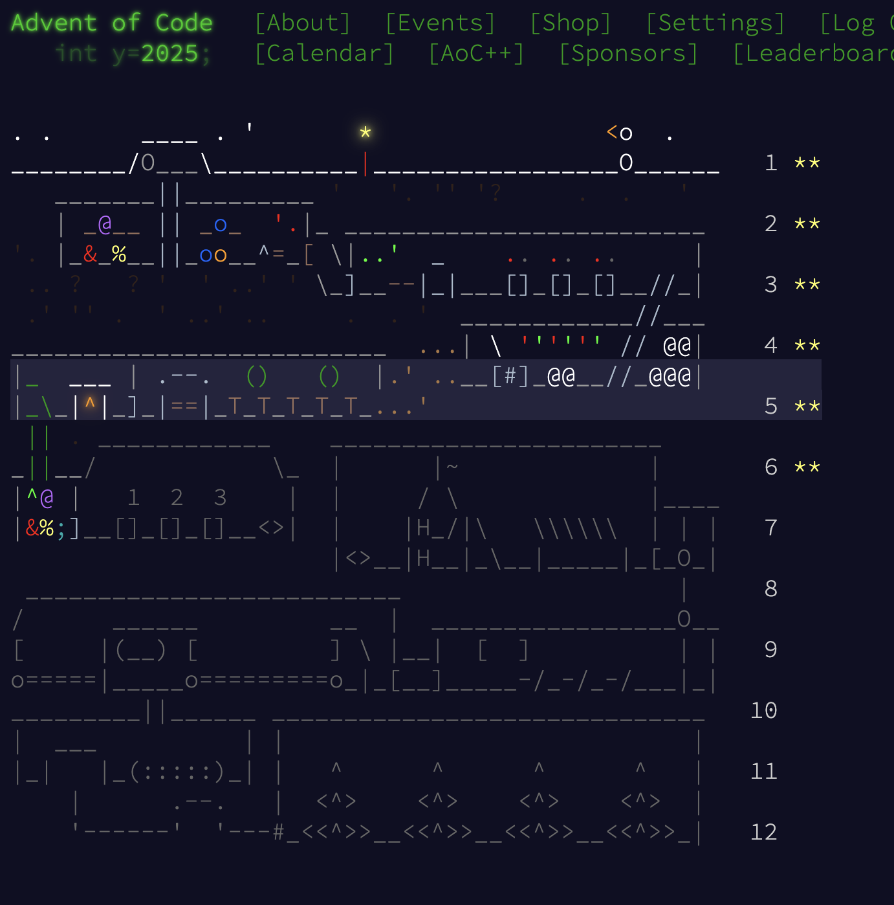

# Advent of Code 2025

Solving Advent of Code 2025 in **Python**, **Rust**, and **Julia** for consistent multi-language verification.

## Progress

- ✅ Day 1: Safe Combination Dial Rotation
- ✅ Day 2: Invalid Product IDs (Repeating Digits)
- ✅ Day 3: Maximum Battery Joltage Selection
- ✅ Day 4: Paper Roll Accessibility
- ✅ Day 5: Ingredient Freshness Ranges
- ✅ Day 6: Cephalopod Math (Vertical & Right-to-Left)

## Project Structure

```
AOC25/
├── Python/
│   ├── Day01/
│   ├── Day02/
│   ├── Day03/
│   ├── Day04/
│   ├── Day05/
│   ├── Day06/
│   └── ...
├── Rust/
│   ├── Day01/
│   ├── Day02/
│   ├── Day03/
│   ├── Day04/
│   ├── Day05/
│   ├── Day06/
│   └── ...
└── Julia/
    ├── Day01/
    ├── Day02/
    ├── Day03/
    ├── Day04/
    ├── Day05/
    ├── Day06/
    └── ...
```

## Running Solutions

### Python

```bash
cd Python/DayXX && python3 solution.py
```

### Rust

```bash
cd Rust/DayXX && cargo run --release
```

### Julia

```bash
cd Julia/DayXX && julia solution.jl
```


